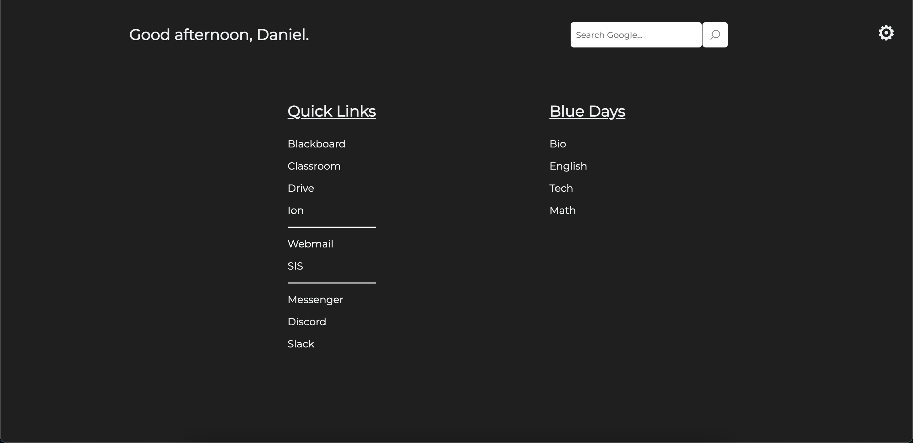

# 🔎 New Tab Page

 📄 A customizable page that activates when opening a new tab using the [New Tab Redirect Extension](https://chrome.google.com/webstore/detail/new-tab-redirect/icpgjfneehieebagbmdbhnlpiopdcmna?hl=en-US 'New Tab Redirect Chrome Extension').

This page contains the links you use most often so that when you open a new tab, you can quickly navigate where you need to be. This page helps you get to your favorite websites, virtual classes, etc. more quickly.

---

## 🚀 If you'd like to make your own new tab page:

1. Fork this repo
2. Clone it to start editing locally

> _If you don't have Git installed, you can download it [here](https://git-scm.com/downloads 'Git Download')._

3. Customize your page by adding your own links to the index.html file
4. Install the New Tab Redirect Extension ([Chrome Extension](https://chrome.google.com/webstore/detail/new-tab-redirect/icpgjfneehieebagbmdbhnlpiopdcmna?hl=en-US 'New Tab Redirect Chrome Extension'))
5. In the New Tab Redirect options, change the redirect URL to the local path to your index.html file
> _For setting the redirect URL to a local file, type_ `file://` _before the local path to your index.html file_